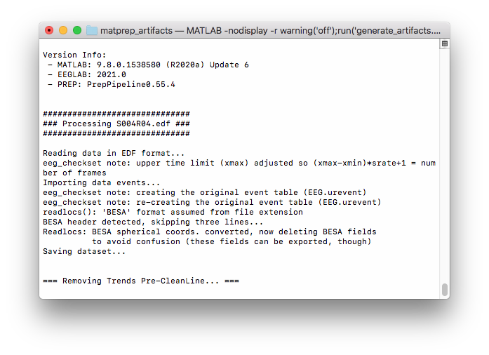

# matprep_artifacts

A set of scripts to run the full MATLAB PREP pipeline on a given test file, saving `.set` and `.mat` artifacts at each step of the process.

These scripts are designed to help the automated testing of [pyprep](https://github.com/sappelhoff/pyprep) against MATLAB PREP for numeric equivalence.

## Artifacts

Currently, the pipeline script creates and saves the following artifacts:

Name | Description
--- | ---
`1_matprep_raw.set` | The montage-fitted test data prior to running PREP.
`2_matprep_removetrend.set` | The test data following pre-CleanLine trend removal.
`3_matprep_cleanline.set` | The test data following adaptive line noise removal.
`4_matprep_pre_reference.set` | The test data following pre-reference trend removal.
`5_matprep_post_reference.set` | The test data following robust re-referencing & interpolation.
`matprep_info.mat` | A .mat file containing detailed info about noisy channels during re-referencing.
